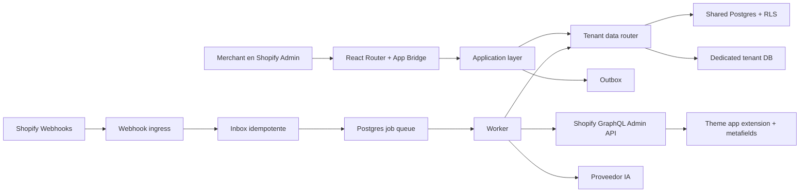
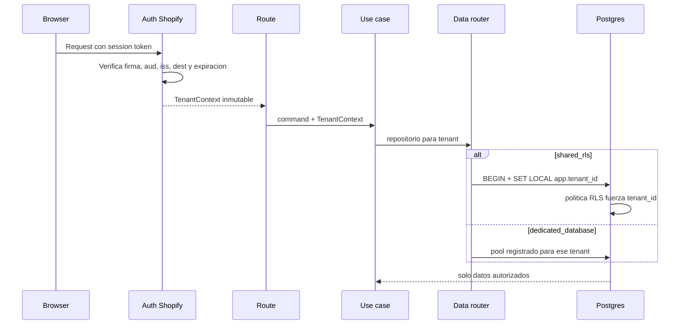
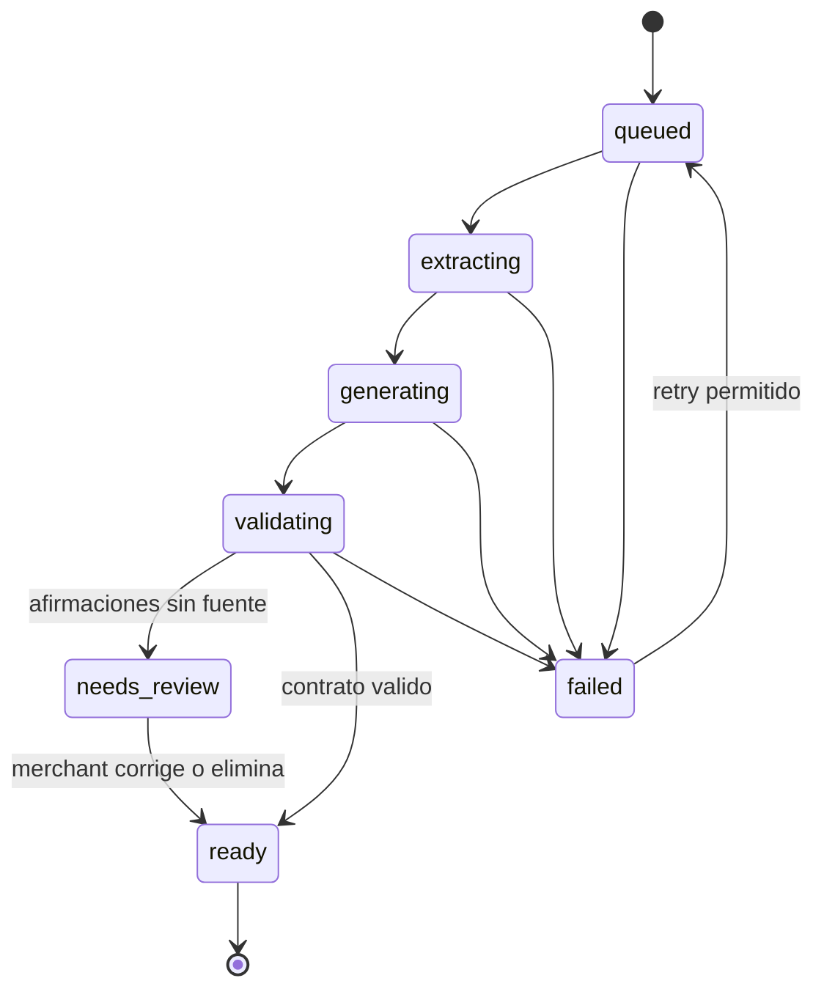

# TiendaIQ v2 - Arquitectura objetivo y plan de reconstruccion

Estado: propuesta ejecutable, 9 de agosto de 2026.

Este documento define la arquitectura a la que se migra TiendaIQ. No describe
un producto idealizado: parte del codigo actual, de los flujos reales de
Shopify y de los riesgos encontrados en la auditoria.

## 1. Objetivo

TiendaIQ debe permitir que un merchant:

1. instale la app desde Shopify sin una ruta manual alternativa;
2. elija un producto y genere una pagina con IA;
3. revise y edite afirmaciones antes de publicar;
4. publique mediante theme app extension y metafields;
5. configure bundles sin dejar descuentos huerfanos;
6. pueda desinstalar o pedir borrado y obtener una eliminacion verificable;
7. nunca pueda leer ni modificar datos de otra tienda por un filtro olvidado.

La meta no es distribuir el sistema en muchos servicios. La meta es hacer
imposibles los errores caros con la menor complejidad operativa razonable.

## 2. Decisiones no negociables

### ADR-001: monolito modular antes que microservicios

La aplicacion web y el worker comparten un repositorio, tipos, casos de uso y
esquema. Se despliegan como dos procesos:

- `web`: autenticacion, UI, API y recepcion rapida de webhooks;
- `worker`: generacion IA, publicacion, reconciliacion y tareas de compliance.

Separar procesos evita bloquear requests largos sin introducir contratos de
red entre cada modulo. Los limites se definen en codigo y se pueden extraer
mas adelante si una metrica real lo justifica.

### ADR-002: React Router oficial de Shopify como borde web objetivo

La migracion converge en la plantilla recomendada por Shopify con
`@shopify/shopify-app-react-router`. El paquete oficial debe asumir:

- instalacion y autenticacion embebida;
- sesiones online/offline;
- Admin GraphQL autenticado;
- headers de App Bridge;
- registro de webhooks;
- limites de billing.

No se reemplaza el runtime actual de una vez. Se construye la aplicacion v2 en
paralelo y se cambia el trafico solo cuando los flujos de instalacion,
generacion, publicacion y borrado tienen paridad.

### ADR-003: tenant obtenido de identidad firmada, nunca del body

El `shopDomain` se deriva exclusivamente de uno de estos bordes confiables:

- sesion validada por Shopify para requests del admin;
- HMAC y cabeceras Shopify validadas para webhooks;
- payload persistido por el servidor para jobs internos.

Ningun controller acepta `tenantId`, `shop` o una connection string enviada
por el navegador. El contexto es inmutable durante el request.

### ADR-004: aislamiento hibrido, no base por tenant para todos

La estrategia correcta depende del contrato del cliente:

- `shared_rls`: Postgres compartido, `tenant_id` obligatorio y Row Level
  Security. Es el default para merchants pequenos y medianos.
- `dedicated_database`: base exclusiva para clientes enterprise o regulados.
  Usa los mismos repositorios y casos de uso mediante un router de datos.

Una base por cada tienda desde el primer dia multiplica conexiones,
migraciones, backups y costo sin crear valor para la mayoria. Una sola base
sin RLS, en cambio, deja el aislamiento en manos de cada developer. El modelo
hibrido conserva economia en el default y aislamiento fisico donde existe una
razon contractual.

### ADR-005: control plane separado del data plane

El control plane contiene solo datos necesarios para enrutar y operar tenants:

- tenant, estado de instalacion y plan;
- referencia cifrada a credenciales;
- modo de aislamiento y destino de datos;
- version de esquema, ventana de migracion y estado de retencion;
- suscripciones de webhooks e historial de jobs.

El data plane contiene paginas, configuraciones de bundle, publicaciones,
assets y artefactos de IA. Un repositorio de negocio no consulta el control
plane directamente.

### ADR-006: IA propone; el sistema valida y el merchant publica

El modelo nunca genera HTML ni hechos comerciales inventados. Produce un
contrato JSON versionado. Antes de persistirlo:

- se valida contra JSON Schema;
- se rechazan reviews, ratings, garantias y estadisticas sin fuente;
- se guarda procedencia por afirmacion;
- el merchant ve las advertencias antes de publicar.

La aplicacion no debe presentar contenido sintetico como evidencia real.

### ADR-007: los efectos externos son sagas idempotentes

Publicar, sincronizar descuentos y borrar datos atraviesan Postgres y Shopify.
No existe una transaccion ACID entre ambos. Cada operacion se modela como saga:

- clave de idempotencia;
- pasos persistidos;
- reintentos con backoff;
- compensacion explicita;
- reconciliacion periodica;
- estado visible para soporte.

Un timeout o corte de conexion posterior al envio no demuestra que el proveedor
no haya ejecutado la operacion. Ese resultado es ambiguo y no se reintenta de
forma automatica: el job termina con un codigo operativo estable y queda para
reconciliacion o intervencion. Solo los fallos confirmados como transitorios y
anteriores al efecto externo habilitan retry. Esta distincion evita una segunda
generacion facturable o una mutacion duplicada en Shopify.

### ADR-008: migraciones controladas, no un `migrate all` al arrancar

El web process no migra automaticamente todas las bases de tenants. Un rollout
enterprise necesita:

- lock distribuido por destino;
- backup o punto de restauracion confirmado;
- compatibilidad expand/contract;
- canary y oleadas;
- ventana permitida por tenant;
- pausa y rollback operativo;
- auditoria de quien autorizo.

## 3. Mapa de alto nivel



## 4. Limites de modulos

```text
app/
  routes/                    bordes HTTP y pantallas, sin SQL ni SDK IA
  components/                UI por dominio
  styles/                    tokens y layouts
src/
  identity/                  sesiones, instalaciones y scopes
  tenancy/                   TenantContext y data router
  pages/                     borrador, contrato IA, editor y versiones
  generation/                jobs, prompts, schemas y provenance
  publishing/                saga de metafield/template/app block
  bundles/                   reglas y saga de descuentos
  billing/                   entitlement, cupos, alta y baja
  compliance/                privacidad, retencion, exportacion y borrado
  webhooks/                  inbox, handlers y suscripciones
  assets/                    carga, validacion y referencias Shopify Files
  platform/                  Postgres, queue, cifrado, logs y metricas
extensions/
  tiendaiq-widgets/          storefront; no depende del servidor para render
db/
  migrations/               control plane y shared data plane
  policies/                  RLS probado como codigo
tests/
  contract/                  Shopify, IA y contratos JSON
  integration/               Postgres, RLS, inbox/outbox y sagas
  e2e/                       instalacion y journeys del merchant
```

Regla de dependencia: `routes -> application -> domain -> ports`. Los adapters
de Postgres, Shopify y Anthropic implementan ports; el dominio no importa SDKs.

## 5. Contexto de tenant



Invariantes:

- Toda tabla tenant-owned tiene `tenant_id NOT NULL`.
- Las claves unicas incluyen `tenant_id` cuando el identificador no es global.
- Cada transaccion shared ejecuta `SET LOCAL app.tenant_id`.
- RLS se habilita y se fuerza tambien para el owner de la tabla.
- Los jobs llevan un `tenant_id` opaco y vuelven a resolver el destino.
- Logs, cache keys, object storage y metricas tambien se particionan por tenant.
- No existe un `TenantContext` default en produccion.

## 6. Modelo de datos minimo

### Control plane

- `tenants(id, shop_domain, status, isolation_mode, data_locator_id, created_at)`
- `installations(tenant_id, scopes, token_ciphertext, installed_at, revoked_at)`
- `entitlements(tenant_id, plan, status, current_period_end)`
- `data_locators(id, mode, secret_ref, schema_version)`
- `migration_policies(tenant_id, channel, earliest_at, requires_approval)`
- `webhook_subscriptions(tenant_id, topic, shopify_id, status)`
- `inbox_events(id, tenant_id, topic, payload_hash, status, attempts)`
- `jobs(id, tenant_id, type, payload, status, run_after, attempts)`
- `usage_reservations(id, tenant_id, job_id, period, units, status, idempotency_key)`
- `outbox_events(id, tenant_id, type, payload, published_at)`
- `privacy_requests(id, tenant_id, type, status, received_at, completed_at)`

### Data plane

- `pages(tenant_id, id, product_gid, status, current_version, ...)`
- `page_versions(tenant_id, page_id, version, schema_version, document, ...)`
- `generation_runs(tenant_id, id, page_id, model, prompt_version, status, ...)`
- `claims(tenant_id, page_id, json_pointer, source_type, source_ref, status)`
- `publications(tenant_id, id, page_id, idempotency_key, state, remote_refs, ...)`
- `bundle_configs(tenant_id, id, version, document, status, ...)`
- `discount_syncs(tenant_id, id, bundle_id, state, remote_refs, ...)`
- `asset_refs(tenant_id, id, owner_type, owner_id, shopify_gid, status)`

El JSON del editor se versiona, pero los estados operativos y las referencias
remotas viven en columnas/tablas consultables. No se usa un blob para todo.

## 7. Generacion con IA



El request de UI crea el job y devuelve `202` con `jobId`. La UI consulta un
resource de estado o recibe eventos; nunca sostiene una conexion HTTP muda
durante toda la inferencia. Se deduplica por tenant, producto, configuracion y
ventana temporal. Hay timeout, presupuesto de tokens, cancelacion y reintentos
solo para fallos transitorios.

La unidad de cupo no se incrementa y revierte como dos operaciones anonimas.
Cada request crea una `usage_reservation` durable con una idempotency key. Job,
reserva y contador mensual nacen en la misma transaccion bajo lock de tenant.
La pagina y el cambio `reserved -> committed` tambien se escriben juntos. Un
fallo terminal cambia `reserved -> released` y devuelve exactamente esas
unidades; repetir la compensacion no vuelve a descontar. Si el worker cae
despues de registrar el fallo terminal, la solicitud queda durable en el mismo
job. Un carril independiente la reclama con lease y backoff, y el readiness
operativo impide el GO mientras exista una pendiente. Si el worker cae despues
del commit pero antes de completar el job, el retry encuentra la pagina
y no vuelve a ejecutar la IA. Mientras una operacion externa sigue activa, el
worker renueva `locked_at` periodicamente; el lease no puede vencer en medio de
una generacion valida y habilitar una segunda ejecucion concurrente.

## 8. Publicacion

1. bloquear la pagina y crear o reutilizar su job de publicacion activo en la
   misma transaccion;
2. validar que la pagina siga en la version aprobada;
3. escribir metafield versionado;
4. asignar el template suffix cuando corresponda;
5. verificar el storefront o el estado remoto;
6. marcar `published` y emitir outbox event;
7. si un paso falla, reintentar desde el checkpoint;
8. si queda inconsistente, compensar o marcar `needs_attention`.

La pagina cambia a `publicando` y recibe `active_job_id` en la misma transaccion
que crea el job. Dos requests concurrentes del mismo tenant reutilizan el job
activo; no puede quedar una pagina marcada como publicando sin trabajo durable.
Al ejecutar, el worker vuelve a comprobar bajo contexto tenant que el job sigue
siendo el activo. Un job reemplazado termina antes de abrir una sesion Shopify.

Los checkpoints solo habilitan retry cuando prueban que el siguiente efecto no
ocurrio. Si Shopify pudo crear un media object, metafield o referencia remota y
la respuesta se perdio, el job queda en estado de atencion manual; no repite la
mutacion a ciegas. Los errores permanentes confirmados conservan su causa y no
se degradan a un error ambiguo.

Nunca se escribe HTML en archivos del theme. El renderer permanece en la theme
app extension y consume el contrato versionado del metafield.

## 9. Bundles y descuentos

La sincronizacion no borra primero. Se usa replace seguro:

1. construir y validar la configuracion deseada;
2. crear o actualizar los descuentos nuevos;
3. comprobar `userErrors` de cada mutacion;
4. persistir las nuevas referencias;
5. activar el estado nuevo;
6. retirar referencias viejas;
7. reconciliar periodicamente Shopify contra el estado deseado.

Ante un fallo parcial, el estado persistido permite continuar o compensar. No
se mutan IDs solo en memoria.

## 10. Privacidad y seguridad

- `TOKEN_ENC_KEY` es obligatorio fuera de test; el proceso falla al arrancar si
  falta o no tiene el formato esperado.
- TLS de Postgres valida certificados en produccion; no existe fallback
  silencioso a `rejectUnauthorized: false`.
- Webhooks tienen limite de body antes de acumular bytes.
- HMAC se valida sobre bytes crudos antes de confiar en topic, shop o webhook
  id. El payload persistido se minimiza por topic y nunca conserva emails,
  telefonos ni pedidos si el handler no los necesita.
- El inbox responde `200` solo despues del insert durable. `webhook_id` es la
  identidad idempotente; un retry devuelve el evento existente y una colision
  con otro hash se rechaza.
- El worker reclama eventos con lease y `SKIP LOCKED`. Un proceso caido se
  recupera; un fallo usa backoff y termina en `failed` despues de ocho intentos.
- Eventos procesados se retienen 30 dias y auditorias de privacidad 365. Los
  eventos fallidos permanecen como deuda operativa hasta que un operador los
  resuelva o descarte explicitamente; una limpieza automatica nunca puede borrar
  una obligacion pendiente. `shop/redact` borra datos del tenant, vacia payloads
  del inbox y conserva solo una referencia seudonimizada de cumplimiento.
- `customers/data_request`, `customers/redact` y `shop/redact` crean solicitudes
  auditables. `shop/redact` elimina control plane, data plane, jobs, assets y
  backups segun la politica declarada.
- Los paths locales se resuelven y se comprueba que permanezcan dentro de una
  raiz permitida.
- Los scopes se reducen al minimo. TiendaIQ no lee pedidos: el uso de bundles
  sale de `asyncUsageCount` sobre descuentos nativos y no requiere protected
  customer data.
- Los logs nunca contienen tokens, prompts completos con PII ni payloads de
  webhooks sin redaccion.
- Las llamadas GraphQL a Shopify tienen timeout explicito. Un proveedor lento no
  puede retener indefinidamente un worker ni una conexion HTTP.
- Recomendaciones, precios y descuentos del storefront se leen del catalogo real
  de Shopify. Si no hay respuesta, la seccion queda oculta: no existe fallback
  comercial inventado por la IA o por la plantilla.

## 11. Estrategia visual basada en el Figma

El archivo de referencia usa una landing oscura y editorial. Sus reglas, no su
contenido de trading, se convierten en el sistema TiendaIQ:

- fondo casi negro y superficies apenas elevadas;
- tipografia sans de alto contraste, titulares centrados solo en marketing;
- navegacion compacta y bordes finos;
- violeta electrico reservado para CTA, foco y progreso IA;
- demostraciones del producto reales como evidencia principal;
- secciones amplias sin cards decorativas anidadas;
- glow localizado alrededor de la accion o captura principal, nunca como
  decoracion dispersa;
- cards repetibles con radio maximo de 8 px;
- movimiento breve y funcional, respetando `prefers-reduced-motion`.

Tokens iniciales a calibrar contra los frames exportados:

```css
:root {
  --tiq-bg: #08090b;
  --tiq-surface: #111216;
  --tiq-surface-raised: #17181d;
  --tiq-border: #292a31;
  --tiq-text: #f5f5f7;
  --tiq-muted: #a5a6af;
  --tiq-accent: #8b46f6;
  --tiq-accent-strong: #7137df;
  --tiq-success: #35d48a;
  --tiq-danger: #ff6678;
  --tiq-radius: 8px;
}
```

### Dos superficies, una identidad

- Sitio publico: reproduce fielmente la composicion del Figma: hero, prueba de
  producto, capacidades, FAQ y CTA. No usa estadisticas ni testimonios falsos.
- App embebida: usa los mismos tokens, densidad y capturas, pero conserva
  patrones de trabajo: tablas, formularios, estados, save bar, banners y
  navegacion de App Bridge. No se transforma en una landing dentro del admin.

## 12. Ruta de migracion

### Fase 0 - Contener riesgos

- eliminar contenido falso y hardcodes engañosos;
- arreglar borrado de privacidad e instalacion;
- hacer obligatorio el cifrado;
- limitar webhooks y corregir deduplicacion;
- hacer no destructiva la sincronizacion de descuentos.

Gate: App Store blockers cubiertos por pruebas.

### Fase 1 - Introducir limites

- crear `TenantContext`, ports y repositorios;
- agregar control plane, inbox/outbox/jobs y RLS;
- envolver codigo legacy con adapters sin cambiar la UI;
- mover cada endpoint a un caso de uso.

Gate: una prueba negativa demuestra que tenant A no puede leer ni escribir B.

### Fase 2 - Nuevo borde Shopify

- generar el shell React Router oficial;
- migrar sesiones, webhooks y billing;
- montar rutas v2 en paralelo;
- mantener la extension existente y su contrato.

Gate: instalacion limpia, reinstalacion, token vencido y desinstalacion E2E.

### Fase 3 - Frontend

- implementar tokens, shell y componentes;
- migrar inicio, paginas, generacion, editor y bundles por ruta;
- eliminar `innerHTML` y CSS inline al cerrar cada pantalla;
- validar desktop y mobile con screenshots.

Gate: paridad funcional y visual, teclado completo y cero overflow.

### Fase 4 - Procesos recuperables

- mover IA, publicacion y bundles al worker;
- agregar checkpoints, idempotencia, compensacion y reconciliacion;
- mostrar estados operativos y acciones de retry.

Gate: pruebas de fallo inyectado en cada paso externo.

### Fase 5 - App Store

- scopes finales y protected customer data;
- billing de produccion y cancelacion;
- listing, video, credenciales y evidencias;
- privacy URLs, support y matriz QA;
- deploy canary y observabilidad.

Gate: instalacion desde listing, flujo principal sin instrucciones ocultas y
todos los webhooks de compliance verificados.

### Estado real al 10 de agosto de 2026

- Fase 0: mayormente completa. Claims sin fuente, cifrado, borrado, webhooks y
  descuentos tienen defensas. Se retiro el acceso a pedidos y los scopes ya no
  requieren protected customer data.
- Fase 1: parcial avanzada. Existen `TenantContext`, RLS, migraciones, jobs,
  reservas e inbox. El control/data plane normalizado y el router a bases
  dedicadas siguen siendo arquitectura objetivo.
- Fase 2: pendiente. El borde actual conserva OAuth legacy y validacion JWT
  propia; React Router oficial, token exchange y autorizacion por usuario deben
  entrar en paralelo antes de retirar el runtime vigente.
- Fase 3: parcial. Home y recorridos principales tienen el nuevo sistema visual,
  pero el frontend monolitico basado en `innerHTML` aun no alcanzo el gate de
  accesibilidad, regresion visual y eliminacion progresiva de legacy.
- Fase 4: parcial avanzada. Generacion, publicacion y webhooks usan worker,
  idempotencia, leases y compensacion. Bundles, outbox, reconciliacion periodica
  y acciones operativas de retry siguen pendientes.
- Fase 5: parcial. Billing, legales y webhooks obligatorios existen; faltan QA
  vivo, listing, screencast, credenciales de review, scopes definitivos y
  evidencias. `PLAN_TEST=1` impide considerar billing listo para produccion.

Gate inmediato completado: PostgreSQL real valida RLS con roles separados de
migracion, web y worker. Siguiente gate: beta privada completa en una dev store,
desde instalacion hasta desinstalacion y borrado.

## 13. Pruebas obligatorias

- unitarias de dominio y schemas;
- integracion Postgres real para RLS, locks, inbox/outbox y borrado;
- contract tests para GraphQL `userErrors` y payloads de webhooks;
- E2E de instalacion, session tokens, billing, generar, editar y publicar;
- prueba cruzada con dos tenants y datos senuelo;
- fallos parciales de bundles/publicacion y recuperacion;
- visual regression 1440, 1024, 768 y 390 px;
- accesibilidad automatica y recorrido por teclado;
- carga sobre colas, limites de proveedor y pool de conexiones.

## 14. Criterio para retirar legacy

Un modulo legacy solo se elimina cuando:

1. su replacement procesa trafico real o fixtures representativos;
2. existe rollback documentado;
3. sus datos fueron migrados y conciliados;
4. sus pruebas pasan en CI;
5. dashboards y alertas cubren el nuevo flujo;
6. no quedan rutas, scopes ni jobs que lo referencien.

La reconstruccion se completa por capacidades verticales, no por cantidad de
archivos movidos.
